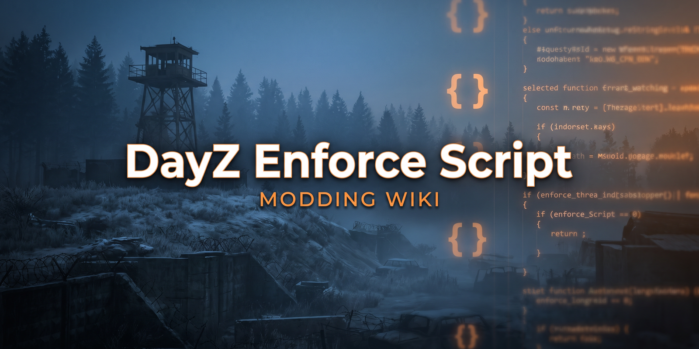

# DayZ Enforce Script — Modding Wiki

<p align="center">
  
</p>

<p align="center">
  <b>A practical, hands-on guide to creating DayZ mods with Enforce Script & the Enfusion engine.</b><br>
  Not a dump of existing mod structures — a focused playbook for <i>how to actually build</i>: layers, RPC, actions, UI, frameworks, and the syntax traps that crash the compiler.
</p>

<p align="center">
  
  
  
  <a href="LICENSE"></a>
</p>

<p align="center">
  
  
  
  
  
</p>

---

## What This Is

This wiki teaches you **how to create mods** for DayZ Standalone — it does **not** document the internals of any one mod. Every page is task-oriented: pick what you want to build, jump to the guide, copy the pattern.

It also ships a complete **AI coding ruleset** ([Safe AI Coding Prompt](Frameworks/Safe-AI-CodingPrompt.md)) so assistants generate Enforce Script that compiles the first time — no ternaries, no `GetGame()`, no multi-variable declarations, correct script layers.

---

## Repository Layout

```text
DAYZ_Enforce-Script/
├── README.md                       ← this file
│
├── How-To/                         ← step-by-step build guides (mods, RPC, actions, UI…)
├── Tips/                           ← language & engine gotchas, style, memory, debugging
├── Frameworks/                     ← Community Framework, Dabs, Expansion + AI coding rules
│   └── Community-Framework/CF/     ← CF logging, RPC, notifications, ModStorage
├── Layouts/                        ← layouts, MVC, ViewBinding, ScriptInvoker, widget reference
│   ├── Advanced/ · Examples/ · How-To/ · Reference/
│
├── DayZGame/                       ← version-specific breaking changes & notes
└── DME_129_Audit_Prompt.md         ← 1.29 migration / audit checklist
```

---

## Sections

<table>
<tr>
<td width="33%" valign="top">

### 🚀 How-To
- [Create a Mod](How-To/How-To-Create-Mod.md)
- [Basic Mod Structure](How-To/Basic-Mod-Structure.md)
- [Script Layers Guide](How-To/Script-Layers-Guide.md)
- [Module System](How-To/Module-System.md)
- [Use Enums](How-To/How-To-Enums.md)
- [Use RPC](How-To/How-To-RPC.md)
- [Create a Logger](How-To/How-To-Logger.md)
- [Profile Settings](How-To/How-To-Profile-Settings.md)
- [Validate Config Data](How-To/How-To-Validate-Config-Data.md)
- [Create Actions](How-To/How-To-Actions.md)
- [Create Recipes](How-To/How-To-Recipes.md)
- [Create UI Menus](How-To/How-To-UI-Menus.md)
- [Layout Controls](How-To/How-To-Layout-Controls.md)
- [Layouts (overview)](How-To/How-To-Layout.md)

</td>
<td width="33%" valign="top">

### 💡 Tips
- [Best Practices](Tips/Tips-Best-Practices.md)
- [Common Pitfalls](Tips/Tips-Common-Pitfalls.md)
- [Code Structure](Tips/Tips-Code-Structure.md)
- [Code Organization](Tips/Tips-Code-Organization.md)
- [Type System](Tips/Tips-Type-System.md)
- [Memory Management](Tips/Tips-Memory-Management.md)
- [Modded Classes](Tips/Tips-Modded-Classes.md)
- [Override Keyword](Tips/Tips-Override-Keyword.md)
- [g_Game vs GetGame()](Tips/Tips-g_Game-GetGame.md)
- [Preprocessor Directives](Tips/Tips-Preprocessor-Directives.md)
- [Comments](Tips/Tips-Comments.md)
- [Debugging](Tips/Tips-Debugging.md)
- [Prefixes & Naming](Tips/Tips-Prefixes-Naming.md)
- [EnScript Style Guide](Tips/EnScript-Style-Guide.md)

</td>
<td width="33%" valign="top">

### 🔧 Frameworks & More
- [Community Framework](Frameworks/Community-Framework/Community-Framework.md)
- [CF Logging](Frameworks/Community-Framework/CF/How-To-CF-Logger.md)
- [CF RPC](Frameworks/Community-Framework/CF/How-To-CF-RPC.md)
- [CF Notifications](Frameworks/Community-Framework/CF/How-To-CF-Notifications.md)
- [CF ModStorage](Frameworks/Community-Framework/CF/How-To-CF-ModStorage.md)
- [Dabs Framework](Frameworks/Dabs-Framework.md)
- [DayZ Expansion](Frameworks/DayZ-Expansion.md)
- [Layouts & MVC Guide](Layouts/README.md)
- [Widget Types Reference](Layouts/Reference/Widget-Types-Reference.md)
- [DayZ 1.29 Notes](DayZGame/DayZ-1.29.161219.md)
- 🤖 [Safe AI Coding Prompt](Frameworks/Safe-AI-CodingPrompt.md)

</td>
</tr>
</table>

---

## Learning Path

| Level | Read in this order |
|-------|--------------------|
| **Beginner** | [Create a Mod](How-To/How-To-Create-Mod.md) → [Basic Mod Structure](How-To/Basic-Mod-Structure.md) → [Script Layers](How-To/Script-Layers-Guide.md) → [Prefixes & Naming](Tips/Tips-Prefixes-Naming.md) → [Modded Classes](Tips/Tips-Modded-Classes.md) → [Override Keyword](Tips/Tips-Override-Keyword.md) |
| **Intermediate** | [Logger](How-To/How-To-Logger.md) → [Profile Settings](How-To/How-To-Profile-Settings.md) → [Validate Config Data](How-To/How-To-Validate-Config-Data.md) → [Module System](How-To/Module-System.md) → [RPC](How-To/How-To-RPC.md) |
| **Advanced** | [Enums](How-To/How-To-Enums.md) → [Memory Management](Tips/Tips-Memory-Management.md) → [Layouts & MVC](Layouts/README.md) → framework-specific guides |

---

## Common Questions

| Question | Go to |
|----------|-------|
| How do I create a mod from scratch? | [How to Create a Mod](How-To/How-To-Create-Mod.md) |
| Where does my code belong (1_Core / 3_Game / 4_World / 5_Mission)? | [Script Layers Guide](How-To/Script-Layers-Guide.md) |
| Why do I get `Broken expression (missing ';'?)`? | [Common Pitfalls — Ternary](Tips/Tips-Common-Pitfalls.md) |
| Can I declare `int a, b, c;` on one line? | [Common Pitfalls — Multi-Var Declaration](Tips/Tips-Common-Pitfalls.md) |
| Should I use `g_Game` or `GetGame()`? | [g_Game vs GetGame()](Tips/Tips-g_Game-GetGame.md) |
| How do I send data between server & client? | [How to Use RPC](How-To/How-To-RPC.md) |
| How do layouts and MVC work? | [Layouts & MVC Guide](Layouts/README.md) |
| When do I use the `override` keyword? | [Override Keyword](Tips/Tips-Override-Keyword.md) |
| What `requiredAddons` should I list? | [How to Create a Mod — Dependencies](How-To/How-To-Create-Mod.md) |
| What are the rules for AI-generated code? | [Safe AI Coding Prompt](Frameworks/Safe-AI-CodingPrompt.md) |

---

## Quick Reference

**Modded class** — extend vanilla, call `super` first:
```c
modded class ItemBase
{
	override void OnStoreLoad(ParamsReadContext ctx, int version)
	{
		super.OnStoreLoad(ctx, version);
		// your code here
	}
}
```

**`g_Game` (DayZ 1.29+)** — never `GetGame()`, authority via `IsDedicatedServer()`:
```c
if (g_Game && g_Game.IsDedicatedServer())
{
	// server-only
}
```

**No ternary operator** — use `if/else`:
```c
// ❌ string result = condition ? "yes" : "no";
string result;
if (condition)
	result = "yes";
else
	result = "no";
```

**No multi-variable declarations** — one per line:
```c
// ❌ int a, b, c;
int a;
int b;
int c;
```

**Keep function calls on a single line** — no multi-line argument lists:
```c
// ❌ MyFunction(\n  param1,\n  param2\n);
MyFunction(param1, param2);
```

---

## Script Layers — Cheat Sheet

| Layer | Purpose | What goes here |
|-------|---------|----------------|
| `1_Core` | Engine core / utilities | Base utilities, constants, math/string helpers. No game classes. |
| `3_Game` | Game logic / configs | Modules, settings, enums, logging. No world entities. |
| `4_World` | World entities | `ItemBase`, `PlayerBase`, `EntityAI` mods. Actions live here. |
| `5_Mission` | Mission & GUI | `MissionGameplay`, `MissionServer`, `UIScriptedMenu`, GUI. |

> **Rule:** lower layers can **never** reference higher layers. `3_Game` cannot touch `4_World` or `5_Mission`.

---

## Authoritative Sources

When in doubt, verify against these — in order — before guessing an API:

1. **DayZ Expansion Scripts** — production-grade patterns for RPC, networking, permissions, UI
2. **Community Framework (CF)** — logging, RPC, notifications, ModStorage, lifecycle hooks
3. **Dabs Framework** — base classes, helpers, naming conventions
4. **Vanilla DayZ Source** — match method signatures exactly; never guess
5. **[EnScript Style Guide](Tips/EnScript-Style-Guide.md)** — naming, formatting, structure

---

## Contributing

This is a living reference. To add or fix a guide:

1. Keep the **task-oriented** tone — "how to build X", with copy-pasteable examples.
2. Put new pages in the matching folder (`How-To/`, `Tips/`, `Frameworks/`, `Layouts/`).
3. Use tabs for code indentation and follow the [EnScript Style Guide](Tips/EnScript-Style-Guide.md).
4. Link new pages from this README's index so they're discoverable.

---

<p align="center">
  <b>Focus:</b> teaching you how to <i>create</i> mods — not documenting existing ones.<br>
  Contributions, corrections, and new guides welcome.
</p>
